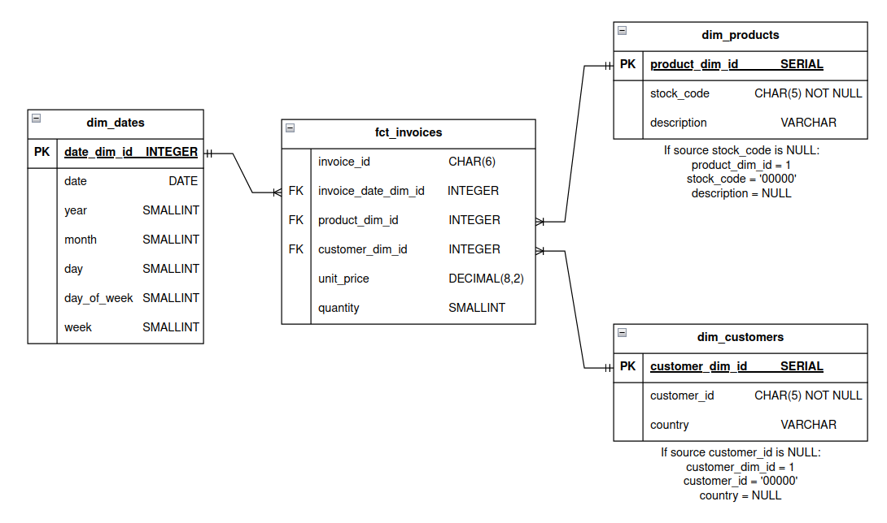

# etl-online-retail

A mini end-to-end ETL project.

## 1. About this project

This project aims to implement a manual (i.e. no scheduling) ETL pipeline for an online retail store which:
- Extracts and transforms a source `.xlsx` file from [UCI Machine Learning Repository](https://archive.ics.uci.edu/dataset/502/online+retail+ii).
- Loads the transformed data into tables of a data warehouse.
- Includes a simple dashboard as a report.

 
*Data flow*

The data warehouse schema is designed following the [Kimball's dimensional modelling technique](https://www.kimballgroup.com/data-warehouse-business-intelligence-resources/kimball-techniques/dimensional-modeling-techniques/) with the available data from the source `.xlsx` file.


*Data warehouse schema*

## 2. Technologies used

- **Apache Airflow** for data orchestration.
- **pandas** as the main data processing library.
- **Apache Superset** for data visualization.
- **Docker** and **Docker Compose** for the containerized approach.

## 3. Installation

### 3.1. Set up

1. Clone this repo and navigate to project directory:

```shell
git clone https://github.com/minkminkk/etl-online-retail
cd etl-online-retail
```

2. Build images and start containers:

```shell
docker compose up
```

If you already have the containers set up and do not want to recreate containers, do:

```shell
docker compose start
```

### 3.2. Interfaces

- Airflow webserver: `localhost:8080`.
- Superset webserver: `localhost:8088`.

**Note:** Both webservers have the same login credential:

- Username: `admin`.
- Password: `admin`.

### 3.3. Tear down

After you are done, if you want to simply stop containers, do:

```shell
docker compose stop
```

Then next time, you can do `docker compose start` to restart your containers.

If you want to remove all containers, do:

```shell
docker compose down
```

## 4. Usage

### 4.1. Run ETL DAG

After executing part `3.1`, upon accessing webserver, you will be prompted to login. Refer to part `3.2` for username and password.

You will be transferred to the main Airflow UI:


*Airflow UI*

To run the DAG, just click on the "play" button on the `Actions` column.

### 4.2. Visualization

Once the DAG finished, access Superset webserver (`localhost:8080`), login using credentials in part `3.2`. Then enter the available dashboard and see the visualization.


You can also create your own dashboards here too!